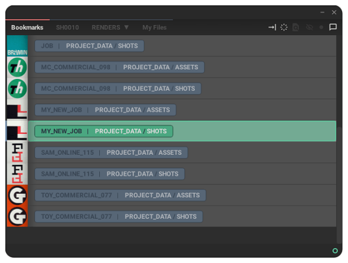
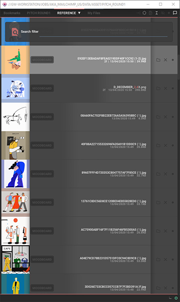
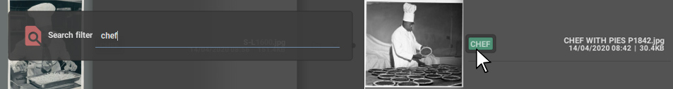
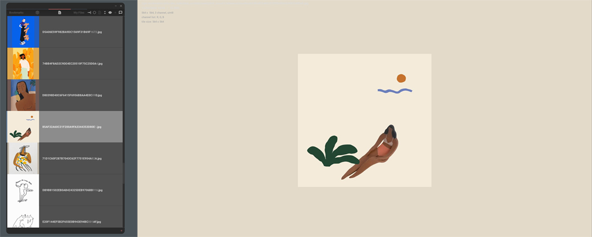

![alt text][logo]

## Bookmarks _A Qt for Python tool for creating, browsing jobs and assets._

 

  

### [Get the latest release.](https://github.com/wgergely/bookmarks/releases)

 

# Overview

Bookmarks is an asset manager used to create and browse jobs and project files. It can link local assets with Shotgun and can save and filter
elements whilst giving a clear overview of your project's contents.

Bookmarks splits job folders into separate parts referred to as bookmark items. For instance. `{job}/SHOTS` and `{jobs}/ASSETS` folders would be considered two separate bookmarks, and can be configured independently to hold framerate, resolution and Shotgun connection information independent of each other.
You can use Bookmarks to create new jobs (using template files) and to new add bookmarks items.

_Assets_ are Maya/Houdini workspace-like folder structures and each contains a
series of sub folders, eg. a _scene_, _render_, _cache_ folder). They live inside bookmark items.
Any folder can be an asset, and any folder containing an asset identifier file (eg.
workspace.mel) will be recognized as such automatically.

And of course, _files_ are stored inside asset sub folders. Bookmarks reads all files
inside a selected __sub folder_, including files in sub-subdirectories. You can use
the provided search and filter tools to find items. <a
href="./bookmarks/rsc/docs/bookmark_graph.jpg" target="_blank">See this folder
diagram for details</a>.

### Search filters

_**Search filters**_ can be used to include or exclude items based on their
description and file name. They are persistent and will stay on unless you
remove them. Click  or press `Alt+F` to edit. To show all chef
images you can simply enter `chef`, or to _hide_ all chefs add two dashes in front of the name, like so: `--chef`

 

The sub-folder labels are clickable. Eg. to **isolate** elements
`Shift+Click`, or to **hide** elements `Alt-Click` on a label.
To reset the all search filters `Alt-Click` on the  search filter icon.

Furthermore, you can always save items into `My Files`, or permanently hide (archive) superflous assets and files.

Bookmarks uses the brilliant OpenImageIO library to generate image previews from most industry-standard image formats. 
Press `space` on your keyboard to preview an image full-screen (tip, this also works for previewing alembic archives contents!).

 

##  Shotgun

We're providing basic Shotgun integration that can be used to link local assets with their Shotgun counterparts.
This can be used to download description and cut information from Shotgun, or to publish local items
via Bookmark's publish widget. We can sync local thumbnails to shotgun, and create Shotgun entities based on our local assets.

##  Maya

Bookmarks started out as a Maya tool for settings the workspaces.
It replaces the internal project manager and uses the current asset for settings the current workspace.
The plugin should be available by enabling the `BookmarksMaya.py` in Maya's plugin manager (under Windows only).

##  Slack

To send messages using Slack, you must configure a bookmark with a valid Slack OAuth token.  The tokens are generated automatically when you install a new app to your Slack Workspace. [See guides on Slack](https://api.slack.com/apps) on how to add a new app and make sure to enable the following scopes:

| OAuth Scopes |`channels:read` `chat:write`  `chat:write.public` `groups:read` `users:read` |
|--|--|

## Credits and Acknowledgments

(c) Gergely Wootsch, 2021.
 
[Email](mailto:hello@gergely-wootsch.com
)
 
[gergely-wootsch.com](http://gergely-wootsch.com)

[logo]: ./bookmarks/rsc/gui/logo_s.png "Bookmarks: A simple file and asset manager for animation and CG productions"
[add]: ./bookmarks/rsc/gui/add.png "Add button"
[maya]: ./bookmarks/rsc/gui/maya.png "Maya button"
[slack]: ./bookmarks/rsc/gui/slack.png "Slack button"
[filter]: ./bookmarks/rsc/gui/filter.png "Filter button"
