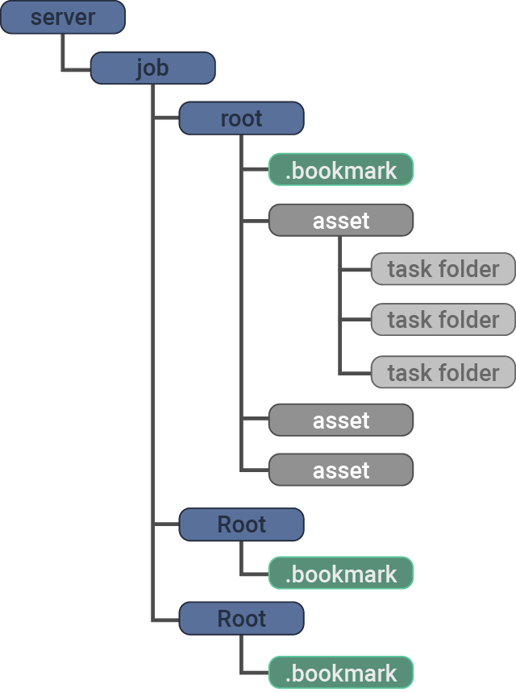

.. meta::
    :description: Bookmarks: A free and open-source asset manager for film, animation and VFX projects.
    :keywords: Bookmarks, asset manager, assets, PySide, Qt5, PySide2, Python, vfx, animation, film, productivity, free, open-source, opensource, lightweight, ShotGrid, RV, FFMpeg, ffmpeg, publish, manage, digital content management, production, OpenImageIO

==============
User Guide
==============

What is this, and why does it exist?
----------------------------------------

😊️ Bookmarks is a free and open-source asset manager for film, animation and VFX projects.

😵  It can be your local hub for accessing assets and files and connecting them with external resources, such as ShotGrid entities and URLs, or a place for notes and comments.

🥳  It helps me create my jobs, shot and asset folders and keep scene files named neat and consistent.

.. |active_bookmark| image:: images/active_bookmark.png

Download
-------------------------

.. admonition:: Latest Windows Release

    `Bookmarks v0.7.1 <https://github.com/wgergely/bookmarks/releases/download/0.7.1/Bookmarks_0.7.1.exe>`_.

`You can find older releases here <https://github.com/wgergely/bookmarks/releases>`_.

I have an issue or question
----------------------------------------------

`Github Issue Tracker <https://github.com/wgergely/bookmarks/issues>`_

Contact
---------

`E-mail <mailto:%22Gergely%20Wootsch%22%3chello@gergely-wootsch.com%3e?subject=%5BBookmarks%5D>`_

How does it work?
-------------------------

Bookmarks reads the content of projects from bookmark, and asset folders. Bookmark items are folders inside a job folder, like a 'scenes' or 'assets' folder, or any other folder where production content resides.

    .. figure:: images/structure.png
        :width: 400

    Bookmark items comprise of server, job and root folders.
    For example: ``//server/jobs/project_0010/path/to/shots_folder`` is a bookmark item, where **//server/jobs** is the server, **project_0010** is the job and **path/to/shots_folder** is the root folder.

    Assets reside in bookmark items and files are read from 'task' folders found inside an asset.

    This is how Bookmarks sees a project:

    .. figure:: images/tree.png
        :width: 280

.. note::

    File thumbnails and saved properties are stored in the ``.bookmark`` cache folder.

.. |structure| image:: images/structure.png
    :width: 480

Here are the main tabs used by the app to display these items:

.. centered:: |window_tabs|

.. |window_tabs| image:: images/window_tabs.png

.. note::

    Per the explanation above, the files are only shown if there's a task folder selected.
    To pick a task folder use the Files tab's dropdown menu or right-click and select
    'Select Task Folder...'.

How do I use it?
--------------------

Here's an awful video of me mumbling, and trying hard to show you how to set it up and
create name template files.

..  youtube:: oKb8KGj78Rg
    :align: center
    :aspect: 16:9

Step-by-step guide
++++++++++++++++++

Add bookmark items
******************

.. carousel::
    :data-bs-keyboard: true
    :data-bs-wrap: true
    :data-bs-touch: true
    :data-bs-pause: hover
    :data-bs-interval: false
        

    .. figure:: images/bookmark_add.png
        :width: 480

        Right-click and select 'Manage bookmark items...' on the Bookmark tab button or window.

.. carousel::
    :data-bs-keyboard: true
    :data-bs-wrap: true
    :data-bs-touch: true
    :data-bs-pause: hover
    :data-bs-interval: false

    .. image:: images/job_add.png

1.1. Add a server
####################

Click the green add icon to add a new server. A server is usually a network location, but we can add **C:/jobs** - make sure the folder exists!

1.2. Add a job
#################

Select **C:/jobs** and create a new job by clicking the green plus icon in the middle section. Name it **DEMO** and select the 'Job' template and click 'Add Job'.

.. hint::

	You can add custom templates by dragging a zip file containing your job template onto the item selector.

1.3. Add bookmark item
######################

You should see a list of root folders appear in the right column. Add them by double-clicking.
Close the editor.

2. Add asset
*****************

Next, let's make a new asset called **DEMO_ASSET**. Double-click 'data/asset' in the main app window to 'activate' it. This will show
the Assets tab and the bookmark item's contents. Right-click on the window and select 'Add Asset...'.

.. carousel::
    :data-bs-keyboard: true
    :data-bs-wrap: true
    :data-bs-touch: true
    :data-bs-pause: hover
    :data-bs-interval: false
    :show_controls:
    :no_fade:

    .. image:: images/active_bookmark.png
    .. image:: images/asset_add.png

Enter the name, select the 'Asset' template and click 'Add asset'.
Select **DEMO_ASSET** and press enter (or double-click it). This will reveal the file contents of the asset.

.. hint::

	You can create sequences and shots in the exact same manner using 'SEQ###' and 'SH####' naming, e.g. SEQ010_SH0010. Unfortunately, the app doesn't support nesting asset folders like 'SEQ010/SH0010'.

3. Add a template file
************************

.. carousel::
    :data-bs-keyboard: true
    :data-bs-wrap: true
    :data-bs-touch: true
    :data-bs-pause: hover
    :data-bs-interval: false
    :show_controls:
    :no_fade:

    .. image:: images/asset_item.png
    .. image:: images/file_add.png
    .. image:: images/file_saver.png

Right-click again and select 'Add File...'. This will reveal a file saver. Set Template to 'Asset Scene Task', the 'Task' to 'comp' and the 'Format' to 'aep'.

We omitted to set the project prefix up earlier, so click the Project Prefix 'Edit' button and set it to 'DP' for Demo Project. That's all. Hit 'Save' to create an empty template file that can be used for naming reference.

.. hint::

    I tend to copy the template file's path (there's a Copy context menu or press CTRL+C) to later paste it when saving a file from After Effects. This lets me skip having to navigate folders.

.. note:: Reading files

    There's a little gotcha: we read file items from the assets' subfolders (or *task folders*), not from the asset folder directly.
    Pick the current *task folder* by clicking the 'Files' tab button or right-clicking the window and selecting 'Select Task Folder...'. This will list all files and folders inside that task folder.

Configuring bookmark and asset items
--------------------------------------------

You can edit basic properties, like external URLs, frame rate, file-filter rules, width, and height attributes. Click the settings icon or press CTRL+E to open an item's properties editor.

The properties will help create footage 'publishes', convert image sequences, and, using the Maya plugin, set the Maya workspace and scene settings. Linking URLs and ShotGrid entities with local files can be beneficial when the project has a lot of external resources to keep track of.

Filters
--------------------

You can sort and filter the item using the buttons on the top bar and the options in the context menus. The label-like item names are clickable: use the 'shift' and 'alt' keyboard modifiers when clicking them to toggle filters.
