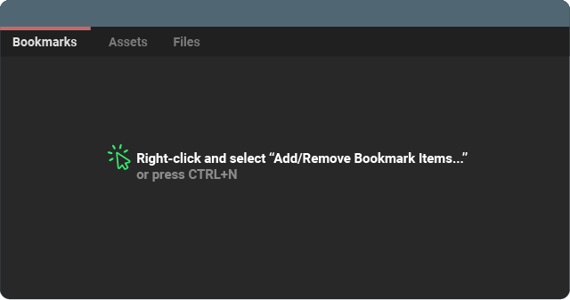
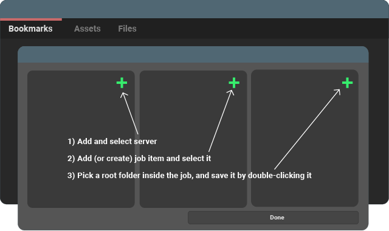
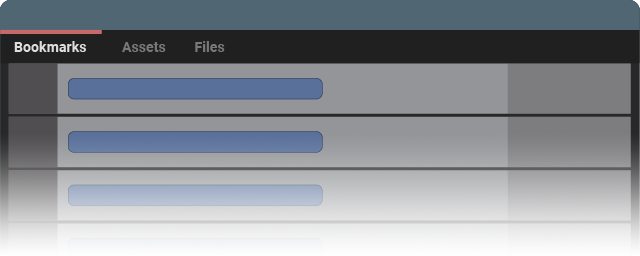
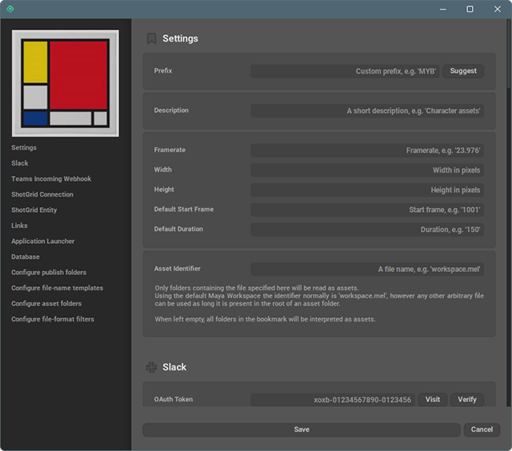
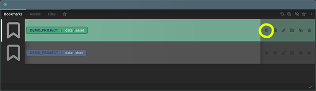

User Guide
##############

You should first `download and install the latest release <https://github.com/wgergely/bookmarks/releases/download/0.6.0/Bookmarks_0.6.0.exe>`_.

.. note::

    There's only Windows releases available at the moment. Still, the app itself can be run
    on any PySide2 environment if all dependencies are satisfied

    .. code-block:: python

        import bookmarks
        bookmarks.exec_()

Adding items
-------------------------------------

.. centered:: |step02|

To add :mod:`bookmark items <bookmarks.items.bookmark_items>`,
right-click and select :mod:`Add/Remove Bookmark Items... <bookmarks.bookmarker>`
(or press ``CTRL+N``).

The items are made up of a server, job and root folder components.
The editor lets you specify these and add the selected items to you current
bookmark item set.

.. centered:: |step03|

.. hint::

    If a server does not contain jobs, Bookmarks can create them using
    :mod:`ZIP template files <bookmarks.templates>`.
    If you make your own custom template, you can add an empty ``.bookmark`` folder inside
    folders you'd like to use as bookmark items (these are usually the `shots`, `assets`,
    `dailies`, etc. folders).

.. centered:: |step04|

If all went well, you should see a list of freshly selected bookmark items in the main
window.

Configuring items
-------------------

The bookmark items you just added, can be configured with basic settings like external urls, frame-rate,
file-filter rules, width, height attributes. Click the settings button on the item or
press ``CTRL+E`` to open the properties editor.

.. centered:: |step06|

The properties will help create footage publishes and video files, and if you're using
the Maya plugin, set your Maya workspace and scene settings. Linking urls and ShotGrid
entities with local files can be beneficial when the project has a lot of external
resources to keep track of.

.. centered:: |step05|

