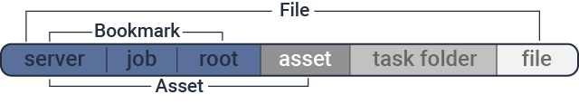
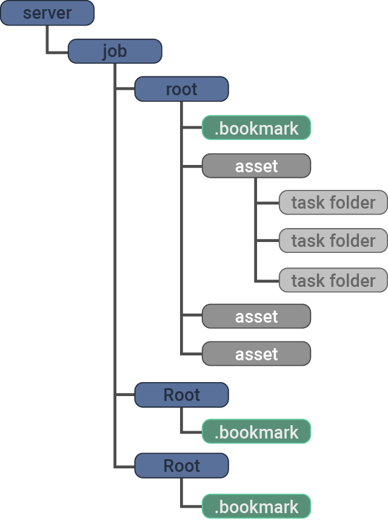

.. meta::
    :description: User documentation page for Bookmarks, a free and open-source Python asset manager for film, animation and VFX projects.
    :keywords: Bookmarks, asset manager, assets, PySide, Qt5, PySide2, Python, vfx, animation, film, productivity, free, open-source, opensource, lightweight, ShotGrid, RV, FFMpeg, ffmpeg, publish, manage, digital content management, production, OpenImageIO

==============
User Guide
==============

😊️ Bookmarks is a free and open-source desktop asset manager for film, animation and VFX projects.

🥳  It can be used to create new shot and asset folders and configure them with simple settings. You can filter items using labels, tags and flags.

😊  Bookmarks can be your friend in linking external resources with local files (like ShotGrid entities, or other online resources).

☹  Features are limited, and perhaps a little clunky. But hey, this is is a personal tool. So, whilst it might not be useful for *you*, I see value in sharing it, since it made my life easier in the past. `I would love to hear what you think!. <mailto:%22Gergely%20Wootsch%22%3chello@gergely-wootsch.com%3e?subject=%5BBookmarks%5D>`_

Get Bookmarks
----------------

The project is hosted on `Github <https://github.com/wgergely/bookmarks>`_.

.. admonition:: Download the latest Windows release: `Bookmarks v0.8.6 <https://github.com/wgergely/bookmarks/releases/download/0.8.6/Bookmarks_0.8.6.exe>`_

    ☹ Currently, Bookmarks only supports Windows.

Introduction
------------

What is a bookmark item?
*************************

.. card:: File path components:
    :class-card: sd-text-center

    .. image:: images/structure.png
        :width: 420

`Bookmarks <.>`_ reads files from :mod:`bookmark <bookmarks.items.bookmark_items>`, :mod:`asset <bookmarks.items.asset_items>` and :mod:`task <bookmarks.items.file_items>` folders.

``//server/jobs/project_0010/path/to/shots_folder`` is a bookmark item, where ``//server/jobs`` is a server, ``project_0010`` is a job and ``path/to/shots_folder`` is a root folder. Together they make up the bookmark item.

Any folder can be used a bookmark item but they usually correspond to folders where digital content is kept, like the usual *scenes*, *assets* or *dailies* folders.

.. card:: This is how the app sees projects:
    :class-card: sd-text-center

    .. figure:: images/tree.png
        :width: 280

    Thumbnails and the database used to keep item properties are stored in the ``.bookmark`` folder.

How do you  add bookmark items?
********************************

There are two ways to add bookmark items, by hand, or by editing the ``default_bookmark_items.json``. The latter is useful for deploying the app per-project with bookmark items already set up correctly. The step-by-step guide below will show you how to add them by hand.

.. grid:: 1
    :gutter: 3

    .. grid-item-card:: Step 1: Open the editor

        .. figure:: images/bookmark_add.png
            :width: 480

        With the bookmark item tab selected, Right-click and select 'Manage bookmark items...' or press ``Ctrl+N``.

    .. grid-item-card:: Step 2: Add server, job and root folders

        .. figure:: images/job_add.png
            :width: 480

        Use the editor to pick a server, select or create a job and the root folders to use as bookmark items. Double-click root folders to add or remove from your current bookmark items.

    .. grid:: 1
        :gutter: 3

        .. grid-item-card:: 2.1. Add server

            Click the green icon on the left-hand side. A server is usually a network location, but local folders work too. Make sure the folder exists before adding it.

        .. grid-item-card:: 2.2. Select or create a job

            If the server already contains folders (jobs), select one here. Otherwise, click the green add icon in the middle column to create a new job.

            .. hint::

                You can add your own job folder templates by dragging them onto the template picker. They should be zip files containing a folder structure.

        .. grid-item-card:: 2.3. Select or pick new root folders

            Select a job. If you used the default job template to create one, it comes with pre-defined root-folders (e.g. the ``data/asset``, ``data/shot`` folders). If you used a custom template, you might need to pick a new root folder by clicking the green add icon on the right-hand side.

            .. hint::

                Any folder with a ``.bookmark`` folder inside them will be read as a root folder. If the folder doesn't show up, you might have to change the folder parsing depth in the preferences.

            Done! Close the editor when finished.

How do you add new shots and assets?
***************************************

.. grid:: 1
    :gutter: 3

    .. grid-item-card:: Step 1: Activate a bookmark item

        .. figure:: images/active_bookmark.png
            :width: 480

        Double-click any of the bookmark items you have just added. This will activate it and show its contents.

    .. grid-item-card:: Step 2: Open the editor

        .. figure:: images/asset_add.png
            :width: 480

        With the *Assets* tab selected, Right-click and select 'Add Asset...' or press ``Ctrl+N``.

    .. grid-item-card:: Step 3: Create a new asset

        Select an asset template (this is a zip file of the folder structure), and enter a name.

        Bookmarks doesn't make distinction between shots and assets, so you can use the same templates for both
        However, Bookmarks will recognise the sequence and shot number from the name, so it's a good idea to use a
        naming convention that includes these when creating shot items.
        E.g. ``SEQ010/SH0010`` or ``010_0010``.

        Nested assets are supported and can be created by adding a ``/`` to the name. E.g. ``SEQ010/SH0010``.
        This will create a ``.links`` file in the root asset folder containing all the relative paths of the subfolder.
        When implementing your own file templates, it is a good idea to add these links to the template, so that
        when the asset is created, the subfolders are automatically added to the asset.

        .. hint::

            You can add your own asset folder templates by dragging them onto the template picker.

        Done! Close the editor when finished.

How do you add reference files?
***************************************

Bookmarks can help with suggesting file names and locations for DCCs by creating an empty file with the correct name and location.
The file name templates are editable in the bookmark item editor (see the :mod:`bookmarks.tokens` module details for more info).

.. grid:: 1
    :gutter: 3

    .. grid-item-card:: Step 1: Activate an asset item

        .. figure:: images/asset_item.png
            :width: 480

        Double-click an asset items you just created. This will activate it, but won't show files until a ``task`` folder is selected.

        .. hint::

            You can change the current task folder by clicking the file tab button, or right-click and select 'Change task folder'

    .. grid-item-card:: Step 2: Open the editor

        .. figure:: images/file_add.png
            :width: 480

        With the *File* tab selected, Right-click and select 'Add File...' or press ``Ctrl+N``. This will reveal the file saver.

    .. grid-item-card:: Step 3: Change template options

        .. figure:: images/file_saver.png
            :width: 480

        Assuming you'd like to make a name template for an After Effects comp file, set the 'Task' to 'comp' and the 'Format' to 'aep'. Pick a name template.

        We didn't set the project prefix, so click the 'Edit' button and set it to something of you choosing (the prefix is a short name of the job). Hit *Save* to create an empty template file to be used for naming reference.

        .. hint::

            I tend to copy the template file's path (there's a Copy context menu or press CTRL+C) to later paste it when saving a file from After Effects. This lets me skip having to navigate folders.

How do you configure bookmark items?
************************************************

.. card:: Bookmark property editor

    .. figure:: images/bookmark_properties2.png
        :width: 480

    To edit basic properties, like external URLs, frame rate, file-filter rules, width, and height attributes, select a bookmark item and click the settings icon, or hit ``Ctrl+E``.

    The properties will help create footage 'publishes', convert image sequences, and, using the Maya plugin, set the Maya workspace and scene settings. Linking URLs and ShotGrid entities with local files can be beneficial when the project has a lot of external resources to keep track of.

    There are also filter options to associate task folders with file formats. And more!

Report issues
----------------

For questions, feature requests, bugs use the `Github Issue Tracker <https://github.com/wgergely/bookmarks/issues>`_

About the author
------------------

I'm an animator/3D generalist with a passion for beautiful images and the tools used to create them. You can contact me via `Twitter <https://twitter.com/wgergely>`_, or send me and `email <mailto:%22Gergely%20Wootsch%22%3chello@gergely-wootsch.com%3e?subject=%5BBookmarks%5D>`_.

.. |icon| image:: _static/icon.png
    :class: no-scaled-link
    :width: 14px